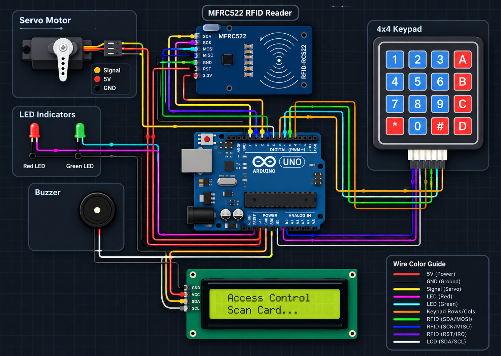

#  Smart Door Lock System

An Arduino-based smart door lock system that combines **RFID card access** and a **keypad backup password**, with real-time status feedback through an LCD display, LED indicators, and a buzzer.


---

##  Overview

This project simulates a dual-authentication smart lock:

- Tap an **authorized RFID card** to unlock the door, **or**
- Enter the correct **4-digit password** on the keypad as a backup method.

On successful authentication, a servo motor rotates to simulate the door unlocking, the LCD confirms access, the green LED lights up, and a short buzzer tone sounds. On failure, the red LED stays on and the buzzer sounds an error pattern. The door auto-locks again after a few seconds.

---

##  Features

-  **RFID-based access** using the MFRC522 module
-  **Keypad password backup** (4x4 membrane keypad)
-  **Audio feedback** via buzzer (success tone / error pattern)
-  **Visual status indicators** using Red (locked) and Green (unlocked) LEDs
-  **16x2 I2C LCD** showing live system status (`Who goes there?`, `Enter, mortal!`, `YOU SHALL NOT PASS!`, etc.)
-  **Servo-driven lock mechanism** with automatic re-lock after a timeout
-  Serial Monitor debug logging for keypad input and servo actions

---

##  Circuit Diagram



### Pin Connections

| Component | Device Pin/Wire | Arduino Pin |
|:---|:---|:---|
| **MFRC522 RFID Reader** | SDA (SS) | 10 |
| | SCK | 13 |
| | MOSI | 11 |
| | MISO | 12 |
| | RST | 9 |
| | GND | GND |
| | 3.3V | 3.3V |
| **4x4 Keypad** | R1 | A1 |
| | R2 | A2 |
| | R3 | A3 |
| | R4 | 0 (RX) |
| | C1 | 2 |
| | C2 | 3 |
| | C3 | 4 |
| | C4 | 5 |
| **16x2 LCD (I2C)** | VCC | 5V |
| | GND | GND |
| | SDA | A4 |
| | SCL | A5 |
| **Servo Motor** | Signal | 6 |
| | VCC | 5V |
| | GND | GND |
| **LEDs & Buzzer** | Green LED (+) | 7 |
| | Red LED (+) | 8 |
| | Buzzer (+) | A0 |

---

##  Software & Libraries

Install these libraries via the Arduino Library Manager:

- [`MFRC522`](https://github.com/miguelbalboa/rfid) — RFID reader communication
- [`Keypad`](https://playground.arduino.cc/Code/Keypad/) — 4x4 matrix keypad input
- [`LiquidCrystal_I2C`](https://github.com/johnrickman/LiquidCrystal_I2C) — I2C LCD display
- `Servo` — built into the Arduino core
- `SPI` / `Wire` — built into the Arduino core

---

##  Getting Started

### Run on Real Hardware
1. Wire the components according to the [pin connection tables](#pin-connections) above.
2. Install the required libraries listed above via the Arduino IDE Library Manager.
3. Select **Arduino Uno** as your board and the correct COM port.

###  Setting Your RFID Card UID
```cpp
byte validUID[4]={0x01,0x02,0x03,0x09};   // Replace with your RFID UID
```
To use your own card:
1. Upload the sketch and open the Serial Monitor (9600 baud).
2. Scan your card — the UID will be printed.
3. Replace the placeholder bytes in `validUID[]` with your card's actual UID.

###  Default Password
The default backup password is **`1234`**, configurable here:
```cpp
String password="1234";
```

---

##  How It Works

1. On startup, the LCD displays a welcome message, then switches to the idle **"Who goes there?"** prompt.
2. The system continuously checks for:
   - A new RFID card tap, **or**
   - Keypad input.
3. **RFID path:** if a card is detected, its UID is compared against `validUID[]`. A match grants access; a mismatch denies it.
4. **Keypad path:** digits are collected into `inputPassword` as they're typed. Pressing `#` submits and compares against the stored `password`; pressing `*` clears the current entry.
5. On **access granted**: the green LED turns on, the red LED turns off, a success tone plays, the servo rotates to 90° (unlocked), and the LCD shows `"Enter, mortal!"`. After 5 seconds, the servo returns to 0° (locked) and the LCD shows `"Door Locked"`.
6. On **access denied**: the red LED stays on and a 3-beep error pattern plays on the buzzer.

---

